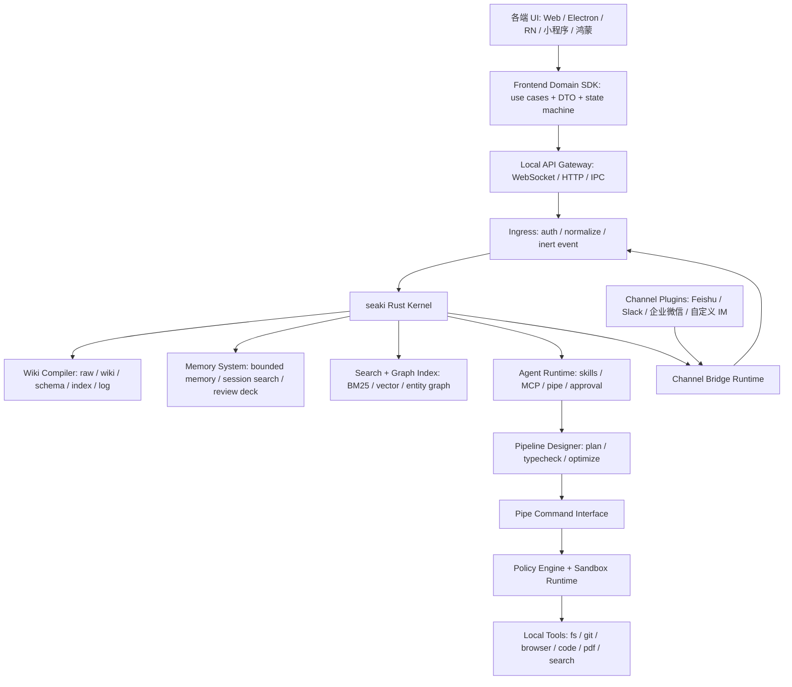

# seaki 架构文档 Wiki

本页是架构入口和导航摘要。详细权威事实维护在 `docs/architecture/` 下的主题页；首页只保留足够读懂全局的心智模型、总架构图和阅读路线。

## 一句话定位

seaki 是一个 local-first 的原生 AI Wiki 工作站：把本地资料、对话、代码、IM 消息、agent 操作和文档演进，持续编译成可审计、可回滚、可引用的知识工程资产。

## 架构不变式

- 原始资料不可变；wiki 页面、claim、索引和回答都是可维护的派生层。
- AI 只提交意图、计划、pipeline AST 或 patch proposal，不直接拥有本地资源执行权。
- Rust Core 是权限裁决、任务调度、沙盒执行、WAL/outbox 和审计的唯一权威入口。
- 所有外部内容默认 untrusted，必须经过确定性校验、policy 和必要审批后才能产生副作用。
- Pipe Command Interface 是核心工具协议；MCP、AI skills 和 IM 适配器是兼容层或插件层。

## 五层结构

| 层 | 职责 | 主要入口 |
| --- | --- | --- |
| 体验层 | Electron/Web/RN/小程序/鸿蒙 UI、平台能力适配、任务状态展示 | [前端抽象](architecture/frontend.md) |
| Core 层 | workspace、task、transaction、approval、capability、审计和事件总线 | [总览与核心分层](architecture/overview.md)、[边界与权威链路](architecture/boundaries.md) |
| 知识层 | raw source、wiki page、claim、citation、schema、index freshness | [Wiki / Source / Citation 知识层](architecture/wiki-source-citation.md) |
| 执行层 | pipe/pipeline、policy、sandbox、broker、local tools | [管道命令接口](architecture/pipeline.md)、[Rust Sandbox Runtime](architecture/sandbox-runtime.md) |
| 连接层 | IM channel bridge、插件生命周期、附件授权、outbox 出站 | [Channel Bridge 插件化](architecture/channel-bridge.md) |

MVP 先收窄到本机纵切：`Electron + Rust daemon + 本机 source 导入 + typed wiki page/claim + BM25 candidate search + approval diff + citation-backed answer + citation 回跳`。完整 Channel Bridge、真实 IM、Pipeline Designer、自动 memory 和跨工具 connector 放到 M1/M2。

## 总体架构

下图是入口导航摘要；crate 分层以 [总览与核心分层](architecture/overview.md) 为准，执行边界以 [边界与权威链路](architecture/boundaries.md) 为准。



权威执行链路的维护页是 [边界与权威链路](architecture/boundaries.md)：

```text
daemon ingress
  -> authenticate / normalize
  -> create inert event
  -> agent proposes intent or plan
  -> deterministic compiler validates schema and scope
  -> policy decides
  -> sandbox or broker enforces
  -> audit / WAL / outbox records result
```

## 阅读路线

首次 10 分钟：

1. 读本页的一句话定位、不变式、五层结构和总图。
2. 读 [总览与核心分层](architecture/overview.md)，理解系统模块和核心协议对象。
3. 读 [边界与权威链路](architecture/boundaries.md)，理解“谁能决定什么”。
4. 读 [Wiki / Source / Citation 知识层](architecture/wiki-source-citation.md)，理解 seaki 的知识资产如何成为权威事实。
5. 读 [MVP 顺序与主要风险](architecture/roadmap-risks.md)，确认首版边界。

架构深入：

- 执行与工具组合：读 [管道命令接口](architecture/pipeline.md) 和 [Rust Sandbox Runtime](architecture/sandbox-runtime.md)。
- 多端产品形态：读 [前端抽象](architecture/frontend.md)。
- IM 与外部入口：读 [Channel Bridge 插件化](architecture/channel-bridge.md)。
- 长期偏好和复习：读 [记忆系统](architecture/memory.md)。
- 需求验证和规格收敛：读 [虚拟需求推演收敛](architecture/scenario-validation.md)。

按任务查找：

| 任务 | 从这里开始 |
| --- | --- |
| 判断模块归属或 crate 边界 | [总览与核心分层](architecture/overview.md) |
| 判断权限、安全、taint、索引隐私 | [边界与权威链路](architecture/boundaries.md) |
| 设计 source、wiki、claim、citation、index freshness | [Wiki / Source / Citation 知识层](architecture/wiki-source-citation.md) |
| 设计工具协议、pipeline、MCP 兼容 | [管道命令接口](architecture/pipeline.md) |
| 设计文件、命令、网络、secret、审计和回滚 | [Rust Sandbox Runtime](architecture/sandbox-runtime.md) |
| 设计 Electron/Web/RN 领域 SDK 和 DTO | [前端抽象](architecture/frontend.md) |
| 设计飞书/Slack/企业微信等 IM 入口 | [Channel Bridge 插件化](architecture/channel-bridge.md) |
| 设计 memory、session search、review learning | [记忆系统](architecture/memory.md) |
| 查外部依据和借鉴来源 | [参考与溯源](#参考与溯源) |

## 主题页

| 页面 | 权威事实范围 |
| --- | --- |
| [总览与核心分层](architecture/overview.md) | 定位、总体架构、Rust crate 分层、核心协议对象 |
| [边界与权威链路](architecture/boundaries.md) | Rust Core 边界、唯一权威执行链路、taint 传播、前端业务边界、索引隐私 |
| [Wiki / Source / Citation 知识层](architecture/wiki-source-citation.md) | raw source CAS、source manifest、parsed frame、wiki page/block/schema、claim/citation、patch transaction、index freshness |
| [管道命令接口](architecture/pipeline.md) | PCI 设计、Pipeline Designer、typed DSL、执行优化、MCP 兼容层 |
| [Rust Sandbox Runtime](architecture/sandbox-runtime.md) | 权限 profile、capability grant、文件系统策略、平台沙盒、审计与回滚 |
| [前端抽象](architecture/frontend.md) | 前端包分层、Domain Use Case、DTO、事件合同、状态机、错误恢复、Electron screen contract |
| [Channel Bridge 插件化](architecture/channel-bridge.md) | IM 插件生命周期、身份映射、附件授权、出站 outbox 和 provider 幂等 |
| [记忆系统](architecture/memory.md) | bounded memory、session search、遗忘曲线、复习学习技能、演化门禁 |
| [MVP 顺序与主要风险](architecture/roadmap-risks.md) | M0/M1/M2 交付顺序、关键风险 |
| [虚拟需求推演收敛](architecture/scenario-validation.md) | 虚拟需求闭环、P1/P2 规格、Dogfood 验收指标 |
| [架构维护记录](architecture/maintenance-log.md) | 结构调整、索引维护和后续整理风险 |

## 参考与溯源

| 编号 | 参考 | 本文借鉴点 |
| --- | --- | --- |
| [R1] | [Karpathy: `llm-wiki.md`](https://gist.github.com/karpathy/442a6bf555914893e9891c11519de94f) | raw sources、wiki、schema、index、log 的知识组织模型 |
| [R2] | [OpenAI Codex GitHub](https://github.com/openai/codex) | Rust 本机 agent、CLI/runtime、桌面工作站参考 |
| [R3] | [Codex sandbox security docs](https://developers.openai.com/codex/agent-approvals-security) | sandbox mode、approval、workspace-write 安全语义 |
| [R4] | [Codex sandboxing source](https://github.com/openai/codex/tree/main/codex-rs/sandboxing) | macOS Seatbelt、Linux bubblewrap/seccomp、policy transform |
| [R5] | [Model Context Protocol](https://modelcontextprotocol.io/) | MCP 作为兼容工具协议，而非 seaki 内核协议 |
| [R6] | [OpenClaw Feishu channel docs](https://docs.openclaw.ai/channels/feishu) | 飞书消息、文件、thread、Drive comment 等 channel action 面 |
| [R7] | [OpenClaw Codex harness docs](https://docs.openclaw.ai/plugins/codex-harness) | channel runtime 与底层 agent executor 的边界 |
| [R8] | [Hermes Persistent Memory](https://github.com/NousResearch/hermes-agent/blob/main/website/docs/user-guide/features/memory.md) | bounded memory、frozen snapshot、session search、安全扫描 |
| [R9] | [Hermes Agent Self-Evolution PLAN](https://github.com/NousResearch/hermes-agent-self-evolution/blob/main/PLAN.md) | 技能/提示优化的评估门禁、不可热替换、人工审核 |
| [R10] | [POSIX Shell Command Language: Pipelines](https://pubs.opengroup.org/onlinepubs/9699919799/utilities/V3_chap02.html#tag_18_09_02) | Unix pipeline 的组合语义参考 |

## 维护约定

- 每个架构事实只放在一个权威主题页；索引页可以保留导航摘要，但必须链接到权威页。
- 引用其他主题时使用相对链接，避免复制长段落。
- 新增重大主题时，同时更新本索引的五层结构、阅读路线、主题页表和维护记录。
- 当文档事实与代码或测试不一致时，优先回查代码、测试和最近决策，再在主题页标记不确定性或修正事实。
