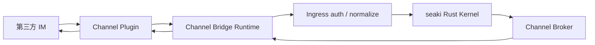

# Channel Bridge 插件化

[返回架构索引](../architecture.md)

权威范围：IM 插件边界、ChannelEvent、附件授权、出站 outbox 和 provider 幂等。

## Channel Bridge 插件化

Channel Bridge 负责接入飞书、Slack、企业微信、Discord、自定义 IM 等外部通信入口。插件只做协议适配，不能直接操作文件、模型、agent 或 wiki。飞书能力面参考 [OpenClaw Feishu channel](https://docs.openclaw.ai/channels/feishu) 的 channel/action 设计，channel runtime 与底层 agent executor 的边界参考 [OpenClaw Codex harness](https://docs.openclaw.ai/plugins/codex-harness)。



插件目录示例：

```text
plugins/channel/feishu/
  plugin.toml
  manifest.json
  commands/
  schemas/
  permissions.toml
  README.md
```

插件声明示例：

```toml
id = "channel.feishu"
name = "Feishu Channel"
version = "0.1.0"
runtime = "wasm"
entry = "feishu_bridge.wasm"

[capabilities]
receive_message = true
send_message = true
send_file = true
thread_reply = true
drive_comment = true
interactive_card = true

[permissions]
network = ["open.feishu.cn"]
local_files = []
brokered_secret_scopes = ["feishu.app:message.send", "feishu.drive:file.read"]
```

`brokered_secret_scopes` 只声明插件需要 broker 代为使用哪些 secret scope；secret 由 Core / secret broker 解析和持有，插件永远拿不到 bearer token、下载 URL 密钥或原始 secret。

插件只能提交 provider 原始身份和签名证明；`seaki_actor_id`、`workspace_role`、`seaki_workspace_id` 和 channel scope 必须由 Core 根据 `provider_tenant_id + channel_binding_id + provider_user_id/union_id` 从绑定表解析，不能由插件声明。Core 审计应同时记录 provider supplied identity 与 core resolved identity。

插件提交的入站事件：

```json
{
  "type": "channel.message.received",
  "channel": "feishu",
  "provider_app_id": "cli_xxx",
  "provider_tenant_id": "tenant_x",
  "channel_binding_id": "bind_abc",
  "provider_chat_id": "chat_y",
  "provider_thread_id": "thread_456",
  "provider_message_id": "msg_123",
  "event_id": "evt_999",
  "event_time": "2026-04-28T10:00:00Z",
  "signature_verified_at": "2026-04-28T10:00:01Z",
  "sender": {
    "provider_user_id": "ou_xxx",
    "provider_union_id": "on_xxx"
  },
  "content": {
    "kind": "text",
    "text": "把这份文档整理进 wiki"
  },
  "attachments": [
    {
      "kind": "channel_attachment_ref",
      "provider": "feishu_drive",
      "provider_tenant_id": "tenant_x",
      "provider_chat_id": "chat_y",
      "provider_message_id": "msg_123",
      "provider_thread_id": "thread_456",
      "provider_file_key": "drive_file_789",
      "provider_file_version": "v3",
      "declared_mime": "application/pdf",
      "declared_size": 1048576,
      "content_hash": null,
      "download_capability_required": true
    }
  ]
}
```

Core 归一化后追加：

```json
{
  "seaki_workspace_id": "ws_123",
  "seaki_actor_id": "user_123",
  "workspace_role": "member",
  "channel_scope": "workspace:ws_123/channel:feishu/chat:chat_y"
}
```

插件安全边界：

- 插件不能直接读写本地文件。
- 插件不能直接调用模型。
- 插件不能直接执行 shell。
- 插件不能读取原始 secret；只能通过 secret broker 使用 scoped opaque token。
- 入站事件必须包含签名校验、时间戳、事件 ID 和防重放字段。
- 插件只能提交 `ChannelEvent`，事件内容是 inert payload。
- 出站消息必须由 Rust Core 生成 `ChannelActionGrant` 后交给插件执行。
- `ChannelActionGrant` 必须包含 scope、audience、ttl、idempotency key 和允许的动作类型。
- Channel broker 负责调用插件，插件不能自行构造或扩大出站动作。
- 插件不能提交 `seaki_actor_id`、workspace role 或 policy decision；这些字段只能由 Core 解析和写入。

Channel 资源授权：

- 附件只能以 `ChannelAttachmentRef` 形式进入 Core，不能由插件把文件内容直接注入 agent 上下文。
- 读取飞书 Drive、Slack file、企业微信文件等远程附件必须使用 `ChannelResourceGrant`，区别于本地 `file.read` 和出站 `ChannelActionGrant`。
- `ChannelResourceGrant` 扩展自 `CapabilityGrant`，必须绑定 `provider_tenant_id`、`provider_chat_id`、`provider_message_id`、`provider_file_key`、`provider_file_version`、resolved `seaki_actor_id`、operation、ttl、`uses_remaining`、audience 和 idempotency key。
- 用户说“刚上传的文件”不能触发模糊搜索；只能读取当前消息显式附带或人工选择的附件引用。
- secret broker 兑换远程下载 token 时，不能把 bearer token 返回给插件、agent 或日志；远程附件下载必须由 Core-owned broker HTTP client 执行，插件只接收 opaque attachment ref、非敏感 provider 结果和发送状态。
- broker 下载到 quarantine 后必须计算 `observed_mime`、`observed_size`、`content_hash` 和 `malware_scan_status`；`declared_mime/declared_size` 只能用于预检和限额，`source.add` 只能使用 observed metadata。
- IM 回复必须携带 provenance：`transaction_id`、`source_id`、`wiki_patch_hash`、citation ids、thread scope 和 audit id。

Channel 出站必须以 `OutboxItem` / `ChannelSendAttempt` 建模：

- `OutboxItem`：`outbox_id`、`transaction_id`、`payload_hash`、`scope`、`audience`、`provider_idempotency_key`、`provider_request_id`、`state`、`compensating_action`。
- `ChannelSendAttempt`：`attempt_id`、`outbox_id`、`lease_owner`、`lease_until`、`attempt_count`、`next_attempt_at`、`last_error_code`。
- dispatcher 只能通过事务抢占 `pending` 或 `unknown` item；`unknown` 必须先按 provider idempotency key 查询发送结果，再决定是否 retry。
