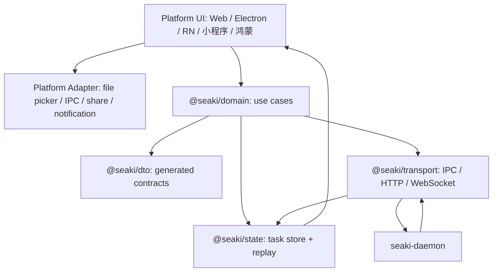

# 前端抽象

[返回架构索引](../architecture.md)

权威范围：前端包分层、Domain Use Case、DTO、事件合同、状态机、错误恢复和 Electron screen contract。

## 前端抽象

前端架构目标是“业务逻辑一次建模，各端 UI 各自实现”。首版只冻结 TypeScript + Electron SDK；React Native、小程序、鸿蒙等复用同一领域契约，但不进入 MVP 工程范围。各端 UI 不直接对接 Rust 内核细节，而是统一使用领域 SDK。UI 可以不同，领域语义、DTO、状态机、错误恢复和审计入口必须一致。



### 包分层

- `@seaki/dto`：MVP 由 Rust 类型生成 TypeScript DTO；ArkTS / Kotlin / Swift codegen 后置。
- `@seaki/transport`：封装 IPC、HTTP、WebSocket、重连、认证、事件 replay 和 backoff。
- `@seaki/domain`：封装 workspace、source、wiki、search、approval、citation、agent run、pipe、memory、channel thread 等 use case。
- `@seaki/state`：处理 streaming events、任务归并、乐观展示、失败恢复和本地只读 cache。
- `@seaki/platform-*`：各平台能力适配，例如 Electron file picker、React Native share sheet、小程序授权、鸿蒙文件选择。
- `@seaki/ui-*`：各端 UI 组件和页面，不承载权威业务规则。

Rust 是 DTO 的 schema source of truth。前端不得手写后端结构体镜像；所有 DTO 通过 codegen 生成，并在 CI 中校验 schema hash。DTO 只表达结构和版本，不表达权限绕过逻辑。

### Domain Use Case

`@seaki/domain` 暴露稳定 use case，而不是让 UI 直接拼 API：

- `workspace.init()`：创建或打开 workspace，返回 revision、audit head、index status。
- `files.prepareUserSelected()`：把平台文件选择结果转成 opaque file ref；不读取文件内容。
- `source.ingestSelectedFile()`：发起 capability request、source ingest、parse、patch proposal。
- `approval.reviewPatch()` / `approval.decide()`：读取 diff、risk summary、citation validation，并提交 approve/reject。
- `wiki.readPage()` / `wiki.readHome()`：只读取已提交 revision；draft 必须明确标记。
- `search.query()`：返回搜索结果、citation refs、index status 和 stale 标记。
- `citation.resolve()`：由 daemon 权威解析 `citation_id -> source_id + range -> preview target`。
- `channel.openThreadMessage()`：展示 IM answer provenance 和 citation chips。
- `pipe.inspect()` / `pipe.dryRun()`：展示 pipeline 能力、读写范围和风险，不直接执行副作用。
- `memory.propose()`：提交候选记忆，不直接写 memory store。

Domain 层只能编排 use case 和 UI 状态，不能判断路径安全、命令权限、secret、IM 出站动作或 wiki 权威事实。所有副作用都必须回到 `seaki-daemon -> seaki-policy`。

### DTO 与事件合同

首版最小 DTO：

- `WorkspaceDTO`：`workspace_id`、`root_uri`、`state`、`current_revision`、`audit_head`、`index_status`。
- `UserSelectedFileDTO`：`selection_id`、`display_name`、`platform`、`opaque_file_ref`、`declared_size`、`declared_mime`。
- `CapabilityGrantRequestDTO`：`operation`、`target`、`ttl`、`uses`、`reason`、`risk_summary`。
- `SourceManifestDTO`：`source_id`、`origin_display`、`mime`、`size`、`parse_status`、`permission_scope`。
- `SourceCardDTO`：`source_id`、`title`、`origin_display`、`range`、`summary`、`visibility`、`citation_refs`。
- `AnnotationDTO`：`annotation_id`、`source_id`、`range`、`note`、`created_by`、`created_at`、`supersede_of`、`conflict_status`。
- `WikiPatchProposalDTO`：`patch_id`、`base_revision`、`diff`、`claim_ids`、`citation_validation`、`risk_summary`。
- `ApprovalRequestDTO`：`approval_id`、`patch_id`、`required_by`、`expires_at`、`policy_decision`。
- `IndexStatusDTO`：`state`、`last_good_revision`、`stale_reason`、`updated_at`。
- `SearchResultDTO`：`result_id`、`kind`、`title`、`snippet`、`citation_refs`、`index_status`；只能由 daemon 可见性回查后返回。
- `CitationRefDTO`：`citation_id`、`source_id`、`range`、`wiki_page_id`、`claim_id`、`degraded_reason`。
- `ChannelAnswerDTO`：`message_id`、`thread_id`、`audit_id`、`transaction_id`、`citation_ids`。
- `OutboxItemDTO`：`outbox_id`、`transaction_id`、`state`、`provider_idempotency_key`、`attempt_count`、`next_attempt_at`。

所有后端事件必须使用统一 envelope：

```json
{
  "event_id": "evt_123",
  "schema_version": "1.0",
  "payload_schema_hash": "sha256:schema...",
  "seq": 42,
  "workspace_id": "ws_123",
  "actor_id": "user_123",
  "scope": "workspace:ws_123",
  "task_id": "task_456",
  "transaction_id": "txn_789",
  "correlation_id": "corr_001",
  "causation_id": "evt_parent_001",
  "revision": "wiki_rev_10",
  "occurred_at": "2026-04-28T10:00:00Z",
  "replayable": true,
  "idempotency_key": "task_456:wiki.patch.proposed",
  "type": "wiki.patch.proposed",
  "payload": {}
}
```

事件必须可 replay；前端刷新、断线重连或切端后，应能根据 `seq`、`task_id`、`transaction_id` 恢复任务状态。UI 不能把未收到 commit 事件的草稿显示成权威事实。

### 状态机

首版必须内建这些任务状态机：

```text
AppBoot
-> daemon.connecting
-> daemon.ready | daemon.unavailable

Workspace
-> uninitialized
-> initializing
-> ready
-> degraded(index_stale | audit_readonly | daemon_recovering)
-> error

Import
-> selected
-> grant_requested
-> granted | capability_denied
-> raw_committed
-> parse_running
-> parsed | partial | failed
-> patch_proposed
-> approval_pending
-> committed | denied
-> indexed | index_stale

Approval
-> pending
-> approved
-> applying
-> committed
-> rejected | expired | conflict

CitationOpen
-> resolving
-> open_wiki_anchor | open_source_range | degraded | no_access
```

可以乐观展示：workspace shell、导入队列行、待审核草稿、提交后索引进度、stale 搜索提示。不能乐观写成事实：raw source 已入库、wiki revision 已提交、citation 有效、index fresh、IM reply 已发送。

### 错误与恢复模型

前端错误必须带 `recoverability`，让 UI 不猜下一步：

| 错误 | 场景 | 恢复方式 |
| --- | --- | --- |
| `ValidationError` | DTO/schema 不合法 | 修正请求或升级客户端 |
| `CapabilityError` | 授权过期、uses 用尽、用户拒绝 | 重新选择文件或重新授权 |
| `PolicyDeniedError` | policy 明确拒绝 | 展示原因，不自动重试 |
| `ApprovalRequiredError` | 需要人工审批 | 打开 approval diff |
| `SandboxError` | 工具执行被拦截或失败 | 查看 sandbox 摘要，可重试安全步骤 |
| `ParseError` | source 已入 CAS 但解析失败 | 保留 source，允许换 parser 或降级 |
| `PatchConflictError` | base revision 过旧 | 重新生成 patch |
| `CitationInvalidError` | citation 越权、缺失或 tombstoned | 回到 source/wiki 重新确认 |
| `IndexError` | rebuild 失败 | 标记 stale，允许重建 |
| `ChannelError` | outbox/send/grant 失败 | 查看 outbox 状态，按幂等重试 |
| `DaemonUnavailableError` | IPC/daemon 不可用 | 进入只读或重连 |

### Electron MVP Screen Contracts

| Screen | 输入 DTO / 事件 | 可触发命令 | 必须处理的状态 |
| --- | --- | --- | --- |
| `DaemonStatus` | `WorkspaceDTO`、daemon heartbeat、`DaemonUnavailableError` | reconnect、open logs | connecting、ready、degraded、readonly、unavailable |
| `WorkspaceShell` | `WorkspaceDTO`、`IndexStatusDTO`、task summary events | workspace.init、index.rebuild | empty、ready、index_stale、audit_readonly |
| `ImportQueue` | `UserSelectedFileDTO`、`SourceManifestDTO`、SourceIngestState events | files.prepareUserSelected、source.ingestSelectedFile、retry parse | capability_denied、failed、partial、index_stale |
| `ApprovalDiff` | `WikiPatchProposalDTO`、`ApprovalRequestDTO`、citation validation events | approval.reviewPatch、approval.decide、regenerate patch | pending、expired、conflict、approved、rejected |
| `WikiReader` | committed page DTO、`CitationRefDTO`、degraded citation events | wiki.readPage、citation.resolve | draft hidden、degraded citation、no access |
| `SearchResults` | `SearchResultDTO`、`IndexStatusDTO`、visibility check events | search.query、index.rebuild、open citation | loading、empty、stale、filtered_by_permission |
| `CitationPreview` | `CitationRefDTO`、`SourceCardDTO`、`AnnotationDTO` | citation.resolve、annotation.create | resolving、open_source_range、degraded、no_access |

`ApprovalDiff` 是信任核心：左侧必须显示 source preview / cited ranges，右侧显示 patch diff；每个 claim 都要展示 citation validation、risk summary、taint/security flags。用户可以批量批准、单条拒绝、填写拒绝原因或触发重新生成；approval 结果必须进入 WAL/audit。

### 后续平台约束

- Electron：首版主线，负责文件选择、文件树展示、编辑器、source preview、本地 IPC 和通知；文件内容读取仍只能通过 daemon 授权。
- Web：适合远程查看、轻量编辑和审批，不直接访问本机文件。
- React Native：偏移动审批、通知、搜索和 IM citation 回跳。
- 小程序：偏轻量检索、审批和分享，不承载复杂导入与编辑。
- 鸿蒙：独立 UI 实现，复用 ArkTS DTO 和 domain use case。

各端 UI 可以有不同交互，但必须遵守同一套 domain use case、DTO、事件 envelope、错误模型和权限提示。任何平台能力都只能生成 opaque ref 或用户意图，不能把文件内容、secret 或自由文本直接注入 agent 执行链路。

Electron 作为桌面主线是合理选择，因为它可以复用 Web UI，并稳定支持文件树、编辑器、预览、终端和本地 IPC。[Codex](https://github.com/openai/codex) 的本机 agent / app 形态可作为工作站体验参考。Tauri 可作为后续轻量化壳，但不作为第一版主线。
