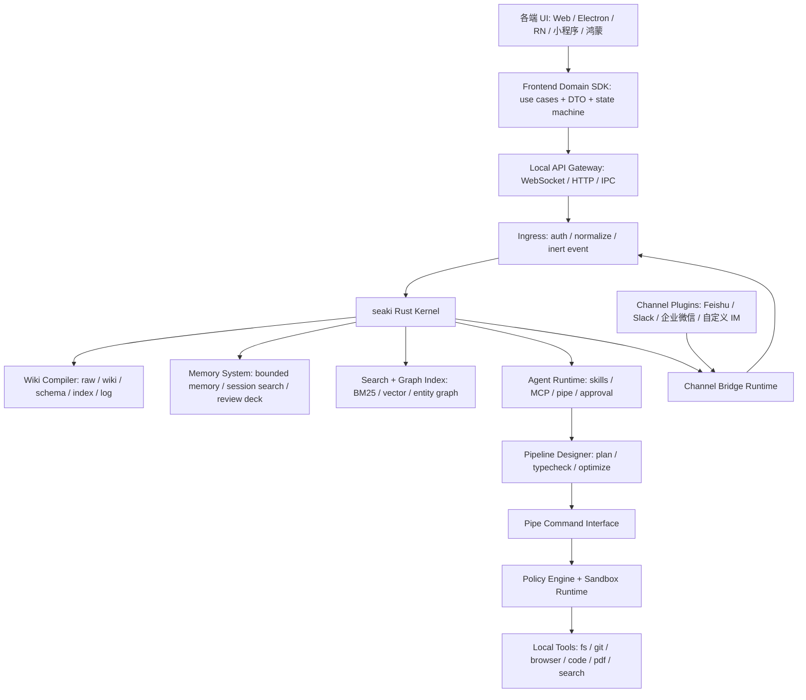

# 总览与核心分层

[返回架构索引](../architecture.md)

权威范围：产品定位、总体架构图、Rust crate 分层和跨层协议对象。

## 定位

seaki 是 sea + wiki 的组合，寓意面向大规模知识海域的 AI 原生 wiki 工作站。本项目目标是基于 [Karpathy `llm-wiki.md`](https://gist.github.com/karpathy/442a6bf555914893e9891c11519de94f) 思路，打造一个 local-first 的原生 AI Wiki 工作站。系统不是传统的“聊天 + RAG”，而是将本地资料、对话、代码、IM 消息、agent 操作和文档演进持续编译成可审计、可回滚、可引用的知识工程资产。

核心原则：

- 原始资料不可变，wiki 页面是可维护的派生知识层。
- AI 只提交意图和 patch，不直接拥有本地资源执行权。
- Rust 核心负责确定性权限裁决、任务调度、沙盒执行和审计。
- 管道命令接口作为核心工具协议，MCP、AI skills、IM 适配器作为兼容层或插件层。

## 总体架构

## Rust 核心分层

建议拆分为以下 crate：

- `seaki-core`：工作区、Task、Transaction、Approval、Capability、事件总线、审计日志和 WAL/outbox。
- `seaki-wiki`：raw source、WikiPage、Claim、CitationRegistry、WikiLog、typed page schema 和 `wiki/index.md` 页面；raw source 必须是 content-addressed、append-only。
- `seaki-pipe`：管道命令接口，负责命令发现、JSON Schema、JSONL streaming、dry-run、typed frames 和 `PatchProposalArtifact`；不负责 patch apply。
- `seaki-pipeline`：管道设计师、pipeline DSL、类型检查、执行图优化和 token/cost 估算。
- `seaki-policy`：权限模型、opaque capability grant、路径 canonicalize、allowlist / denylist、审批策略。
- `seaki-sandbox`：跨平台沙盒执行层，参考 [Codex CLI](https://github.com/openai/codex) 的 Seatbelt、bubblewrap、seccomp、Windows restricted-token 设计。
- `seaki-memory`：受限记忆、会话搜索、遗忘曲线调度、复习卡片和记忆安全扫描。
- `seaki-agent`：模型调用、skills 调度、MCP 兼容、session、compaction。
- `seaki-index`：Tantivy/BM25、向量索引、实体图、反向链接、孤儿页检测和 `IndexGeneration`；只持有可重建派生物，默认本地 embedding，索引按 workspace/account 加密隔离。
- `seaki-channel`：IM 事件归一化、Channel Plugin 生命周期、出站动作审计。
- `seaki-daemon`：本机常驻进程，对前端、IM bridge 和 CLI 暴露统一入口。

### 核心协议对象

这些对象是跨 crate、前端、审计和测试的共享契约，必须由 Rust 定义并生成前端 DTO：

| 对象 | Owner | 关键约束 |
| --- | --- | --- |
| `Task` | `seaki-core` | 用户可见的长任务，绑定 `task_id`、actor、scope、当前 phase、可 replay event seq |
| `Transaction` | `seaki-core` | WAL 原子边界，绑定 source/wiki/memory/approval/audit/outbox 的提交关系 |
| `AuditEvent` | `seaki-core` | append-only、hash chained、默认加密；只记录 token/hash/ref，不记录 bearer 或 secret 原文 |
| `ApprovalRequest` | `seaki-core` | 人工决策对象，包含 risk summary、diff、citation validation、过期时间和审批人 |
| `CapabilityGrant` | `seaki-policy` | opaque grant id，内部记录 issuer、subject、audience、operation、scope、jti、not_before、expires_at、uses_remaining、revoked_at、policy_decision_id |
| `SourceIngestState` | `seaki-wiki` | `selected -> grant_requested -> granted -> raw_committed -> parse_running -> parsed|partial|failed -> patch_proposed -> approval_pending -> committed|denied -> indexed|index_stale` |
| `WikiPatchTransaction` | `seaki-wiki` / `seaki-core` | 唯一 patch apply 入口，执行 base revision、citation validation、WAL、commit、rollback marker |
| `PipelineExecution` | `seaki-pipeline` | pipeline plan 的运行实例，绑定 `plan_id`、dry-run/run、权限预估、checkpoint 和审计 |
| `PipelineStepRun` | `seaki-pipeline` | 单步执行状态，包含输入/输出 schema hash、resource usage、retry boundary |
| `FrameEnvelope` | `seaki-pipe` | typed frame 包装，包含 frame id、schema hash、seq、taint、provenance 和大小限制 |
| `Checkpoint` | `seaki-pipeline` | 可恢复边界，记录 step、frame offset、输入输出 hash 和失败恢复策略 |
| `PipelineError` | `seaki-pipeline` | 结构化错误，包含 retryability、failed step、partial outputs 和 policy/sandbox 摘要 |

`CapabilityGrant` 对外只暴露 opaque id。所有 token 使用、`uses_remaining` 扣减、expiry、revocation 和 audience 校验都必须在 Core/Policy 的同一事务内完成；前端、插件、agent 不能持有可自解释、可伪造的授权 JSON。
