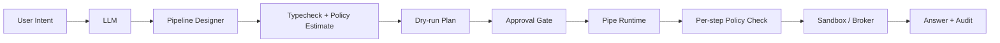

# 管道命令接口

[返回架构索引](../architecture.md)

权威范围：Pipe Command Interface、Pipeline Designer、DSL、执行优化和 MCP 兼容层。

## 管道命令接口

Pipe Command Interface 是系统核心工具协议，借鉴 [Unix pipeline](https://pubs.opengroup.org/onlinepubs/9699919799/utilities/V3_chap02.html#tag_18_09_02) 的组合思想，目标是用可组合、可审计、可 sandbox 的本地命令替代“所有能力都必须接入 [MCP](https://modelcontextprotocol.io/)”的模式。MCP 保留为兼容适配层。

### 为什么不是单次工具调用

MCP 更像是对 CRUD/RPC 工具调用的结构化进化：LLM 每次选择一个 tool，等待结果，再决定下一步。它适合单点能力暴露，但在多步任务里有几个问题：

- 每一步都要回到 LLM 决策，token 和 latency 被多次消耗。
- 中间结果要反复序列化进上下文，容易膨胀。
- 工具组合关系停留在对话隐式状态里，难审计、难复用。
- tool A 的输出到 tool B 的输入缺少显式类型契约。

PCI 的目标是把“多次工具调用”编译成“一条可执行管道”：

```text
用户提问
  -> LLM 决定
  -> decision.search --query "不做某功能 合规风险"
     | citation.resolve --visibility answerable
     | adr.summarize --format answer
  -> 当时因合规风险暂缓，并附原始证据引用
```

传统 MCP 链路：

```text
LLM -> Tool A -> LLM -> Tool B -> LLM -> answer
```

PCI 链路：

```text
LLM -> Pipeline Designer -> typed pipeline -> sandboxed execution -> answer
```

### 管道设计师

管道设计师是 `seaki-pipeline` 的核心角色，负责把用户意图和可用工具编译成 pipeline execution graph。它不是直接执行者，而是 planner/compiler。

职责：

- 发现可用 pipe command、MCP adapter、skills 和本地工具能力。
- 根据 command 的输入/输出 schema 设计管道。
- 做类型检查、scope 检查、权限预估和 token/cost 估算。
- 将可流式执行的步骤合并，减少 LLM 往返。
- 生成 `dry-run` 计划、审计摘要和可解释执行图。
- 在执行失败时给出局部重试计划，而不是重跑整条对话链。

非职责：

- 不直接绕过 `seaki-policy` 执行命令。
- 不把自由文本中间结果直接塞给下游工具。
- 不在 pipeline 中隐藏需要用户审批的副作用。
- 不把失败的 pipeline 自动扩权重试。

### Pipeline DSL

Pipeline DSL 应保持接近 shell 管道，但所有段都是结构化命令，不能退化成任意 shell 字符串。

展示语法示例，仅用于人类阅读，不是规范执行形态：

```bash
decision.search --query "不做某功能 合规风险" \
  | citation.resolve --visibility answerable \
  | adr.summarize --format text
```

规范执行形态必须是 typed AST：

```json
{
  "pipeline": [
    {
      "cmd": "decision.search",
      "args": {
        "query": "不做某功能 合规风险",
        "scope": "workspace.current"
      },
      "out": "DecisionRecord[]"
    },
    {
      "cmd": "citation.resolve",
      "args": {
        "visibility": "answerable"
      },
      "in": "DecisionRecord[]",
      "out": "CitedDecisionRecord[]"
    },
    {
      "cmd": "adr.summarize",
      "args": {
        "format": "text"
      },
      "in": "CitedDecisionRecord[]",
      "out": "TextAnswer"
    }
  ]
}
```

DSL 规则：

- 每个 command 必须声明输入、输出、错误、权限和副作用。
- 管道段之间传递结构化数据，默认 JSONL 或 typed frame。
- `grep`、`filter`、`map`、`reduce` 这类通用算子由 seaki 内置，不能让 agent 拼接危险 shell。
- 文本 DSL 只作为展示语法；规范执行形态必须是 typed AST，不接受任意 shell 字符串。
- `filter` / `map` / `reduce` 的表达式必须是受限 typed AST，不能接收原始字符串；表达式语言必须无副作用、可终止、不可访问文件/网络/环境变量。
- 每段执行必须有 CPU、内存、输出 frame 数、frame 大小和 wall-clock 限额。
- command manifest 必须包含版本、schema hash、权限声明、资源上限和副作用等级。
- 支持 streaming：上游产出一条 frame，下游即可消费。
- 支持 `tee`、`branch`、`join`，但必须形成可审计 DAG。
- 支持 `dry-run`，先展示会读写什么、会调用什么、预计消耗多少。

command manifest 最小字段：

| 字段 | 目的 |
| --- | --- |
| `id/name/version/schema_hash` | 固定命令身份和 schema 版本 |
| `args_schema/input_schema/output_schema/error_schema` | 支撑类型检查和错误恢复 |
| `frame_protocol` | 声明 JSONL、typed frame、是否 streaming |
| `cardinality` | 声明 `one`、`optional`、`many`、`array`，避免 0/N 条误接到单值下游 |
| `compose` | 声明允许的上游/下游类型、谓词约束和失败策略 |
| `policy_operations` | 映射 `NetworkRequest`、`ExternalToolCall`、`MemoryRead`、`MemoryPropose` 等 policy 操作 |
| `side_effect_level` | `none`、`proposal_only`、`persistent`、`external_irreversible` |
| `resource_limits` | CPU、内存、wall-clock、frame 数、frame 大小 |
| `sandbox_profile` | `read-only`、`network-scoped`、`brokered-mcp`、`source-ingest` 等 |
| `approval_policy` | 何时暂停、谁可批准、是否可自动继续 |
| `idempotency/reversibility` | 幂等 key、补偿动作和可重试边界 |

`proposal_only` 的定义：命令只返回 proposal artifact，不写入 memory、wiki、source 或外部系统。proposal 是否落 WAL 必须由后续 `memory.propose`、`wiki.patch.propose` 等显式事务处理，不能藏在无副作用 pipeline 内。

### 执行与优化

Pipeline Designer 生成计划后，执行链路如下：



优化方向：

- 将确定性转换留在 pipe runtime，减少 LLM 参与。
- 将中间结果保存在 runtime frame，不全部注入上下文。
- 将可复用 pipeline 保存为 skill 或 recipe。
- 对纯函数 command 做缓存，对有副作用 command 强制审计。
- 对高频 pipeline 做预编译和 schema-level 优化。

安全规则：

- Pipeline 计划必须先经 `seaki-policy` 估算整体权限。
- 任一段需要审批时，整条 pipeline 暂停在该段之前。
- 每段执行仍进入对应 sandbox profile。
- 下游工具不能继承上游工具未声明的权限。
- 用户可查看每一段输入、输出摘要和失败点。

命令应支持：

- `inspect`：输出能力、参数 JSON Schema、权限需求和副作用说明。
- `run`：执行命令。
- `dry-run`：只生成计划或 patch。
- `explain`：解释将读取或修改哪些资源。
- `audit`：输出 provenance、输入摘要、输出哈希和执行结果。
- `compose`：声明可与哪些输入/输出类型组合，以及组合约束。

事件流采用 JSONL：

```jsonl
{"type":"request","pipeline_execution_id":"pex_1","plan_id":"plan_1","mode":"dry-run"}
{"type":"step.started","pipeline_execution_id":"pex_1","step_run_id":"step_1","cmd":"wiki.search"}
{"type":"frame","pipeline_execution_id":"pex_1","step_run_id":"step_1","frame_id":"fr_1","schema_hash":"sha256:schema...","taint":"trusted_metadata","data":{"candidate_id":"idx_123"}}
{"type":"checkpoint","pipeline_execution_id":"pex_1","step_run_id":"step_1","frame_offset":1,"input_hash":"sha256:in...","output_hash":"sha256:out..."}
{"type":"step.completed","pipeline_execution_id":"pex_1","step_run_id":"step_1","resource_usage":{"wall_ms":42}}
```

`run` 与 `dry-run` 共享 `plan_id`；每个 `PipelineStepRun` 必须产生 `FrameEnvelope`、checkpoint 和结构化 `PipelineError`，以便局部 retry/resume。Pipe runtime 不拥有副作用裁决权，所有副作用步骤仍必须进入 per-step policy check。

MCP 不作为内核协议，而是兼容适配层：

- `mcp-to-pipe`：将现有 MCP tool 包装成 pipe command。
- `pipe-to-mcp`：将稳定 pipe command 暴露给 MCP 客户端。
