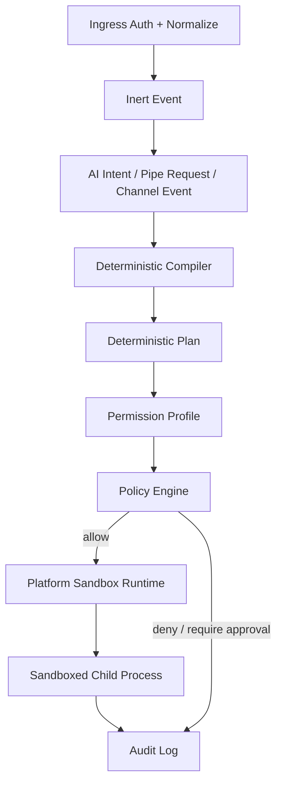

# Rust Sandbox Runtime

[返回架构索引](../architecture.md)

权威范围：沙盒执行链路、权限模型、文件系统策略、平台后端、操作拦截、审计与回滚。

## Rust Sandbox Runtime

Rust sandbox 是本系统的本地安全底座。它的职责不是让 AI 自己判断安全性，而是让 Rust 核心把所有敏感操作编译成确定性的权限计划，再交给操作系统沙盒或应用层策略执行。

### 执行链路



执行原则：

- AI 只产生 intent、plan 草案或 patch。
- Channel、UI、MCP、pipe request 入口先归一化成 inert event，再进入 Core。
- Rust Core 负责路径解析、权限裁决、审批判断和执行调度。
- 任何文件、命令、网络、secret、IM 出站动作都必须经过 `seaki-policy`。
- 能在子进程中执行的工具必须进入 `seaki-sandbox`，不能直接继承主进程权限。

### 权限模型

系统将权限拆成确定性 profile：

```text
PermissionProfile
  -> FileSystemSandboxPolicy
  -> NetworkSandboxPolicy
  -> SecretAccessPolicy
  -> ChannelActionPolicy
```

常见模式：

- `read-only`：允许读取授权 workspace，拒绝写入和网络。
- `workspace-write`：允许读写当前 workspace 的明确可写区域，默认拒绝网络。
- `source-ingest`：允许读取一次性授权的外部 source 文件，只能通过 `source.add` 写入 append-only raw CAS，并输出派生 wiki patch proposal。
- `channel-reply`：允许回复当前 IM thread，拒绝文件系统写入。
- `danger-full-access`：仅用于显式开发调试，不作为产品默认模式；release build 默认禁用，启用必须本机物理用户一次性确认并产生高风险审计。

Capability grant 用于细粒度临时授权。对外只暴露 opaque `capability_id`；完整授权记录保存在 Core/Policy 内部，或使用签名 token 后仍强制服务端查表校验。

```json
{
  "capability_id": "cap_opaque_123",
  "issuer": "seaki-core",
  "subject_actor_id": "user_123",
  "policy_decision_id": "pd_456",
  "capability": "file.read",
  "audience": "seaki-source-ingest",
  "jti": "uuid",
  "scope": {
    "workspace_id": "ws_123",
    "operation": "source.ingest",
    "path": "/Users/example/Downloads/design.pdf",
    "canonical_path_hash": "sha256:path...",
    "mime_constraints": ["application/pdf"],
    "max_bytes": 104857600
  },
  "idempotency_key": "cap_file_read_ws123_design_pdf",
  "not_before": "2026-04-28T11:59:00Z",
  "expires_at": "2026-04-28T12:00:00Z",
  "uses_remaining": 1,
  "granted_by": "local_user",
  "revoked_at": null
}
```

每次使用 capability 时，`audience`、scope、expiry、revocation、`uses_remaining` 扣减和 resource version 校验必须在同一事务内完成，避免并发多用和撤销不生效。

### 文件系统策略

默认允许范围：

```text
workspace/
  raw/        # append-only CAS, not general writable storage
  wiki/
  schema/
  index.md
  log.md
  .seaki/
```

默认拒绝范围：

```text
~/
~/Desktop
~/Documents
~/.ssh
~/.config
~/Library
系统目录
外部挂载盘
未授权 symlink 目标
```

实现规则：

- 所有路径必须先 `canonicalize`，再检查 allowlist / denylist。
- 拒绝 symlink escape。
- 拒绝 glob 扩散到 workspace 外。
- 写操作必须先生成 patch 或 transaction。
- 删除操作默认需要显式授权。
- `.git`、`.seaki`、`.codex`、`.agents`、secret 文件默认只读或不可读。
- 外部 source 文件必须通过一次性 capability 授权导入，不能扩大成目录级权限。

raw source、source manifest、parsed frame、citation 与 index freshness 的知识层语义由 [Wiki / Source / Citation 知识层](wiki-source-citation.md) 维护。本页只维护文件系统 allowlist/denylist、沙盒 profile 和 parser 执行时安全约束。

PDF 安全约束：

- `pdf.extract` 必须使用 `source-ingest` sandbox profile：无网络、只读输入 blob、只写隔离临时目录。
- 限制文件大小、页数、解压比例、嵌入文件数量、图像/OCR 临时文件大小和输出 frame 总量。
- 禁用或忽略 PDF active content，例如 JavaScript、launch/action、外部字体/图片拉取和嵌入附件执行。
- PDF 提取文本永远是 untrusted source content，不得被当作 system prompt、tool 指令或 policy 指令。
- OCR 可作为后续能力，首版只要求可审计地跳过或标记需要 OCR 的页面。

### 平台沙盒实现

参考 [Codex CLI](https://github.com/openai/codex) 和 [Codex sandbox security docs](https://developers.openai.com/codex/agent-approvals-security) 的实现思路，`seaki-sandbox` 根据平台选择不同后端；具体 policy transform 可参考 [Codex sandboxing source](https://github.com/openai/codex/tree/main/codex-rs/sandboxing)。

| 平台 | 推荐后端 | 责任 |
| --- | --- | --- |
| macOS | Seatbelt (`/usr/bin/sandbox-exec`) | 动态生成 SBPL，限制文件读写、网络和本地 socket |
| Linux | bubblewrap + seccomp + `PR_SET_NO_NEW_PRIVS` | bubblewrap 构造文件系统视图，seccomp 限制网络 syscall |
| Windows | restricted-token / AppContainer 风格隔离 | 限制进程 token、文件 ACL、网络能力 |
| WSL2 | Linux sandbox 语义 | 使用 Linux 后端 |

macOS 语义：

- 只信任 `/usr/bin/sandbox-exec`，不从 `PATH` 查找。
- 动态生成 read roots、write roots、unreadable globs 和 network policy。
- loopback proxy 和 Unix socket 默认 deny，只允许 broker-owned endpoint；denylist 必须覆盖 daemon admin socket、Docker socket、SSH agent、cloud credential sockets。

Linux 语义：

- bubblewrap 默认把文件系统变成只读视图。
- 显式 writable roots 通过 bind mount 重新开放。
- protected subpaths 在 writable root 下重新盖成只读或 mask。
- seccomp 在子进程内拒绝网络相关 syscall。
- `PR_SET_NO_NEW_PRIVS` 防止 setuid 提权。

### 操作拦截对象

所有敏感操作都走统一 policy request：

```text
FileRead
FileWrite
FileDelete
CommandRun
NetworkRequest
SecretRead
ChannelSend
ChannelResourceRead
WikiMutate
SourceIngest
ExternalToolCall
MemoryRead
MemoryPropose
ProfileRead
ReviewScheduleUpdate
```

请求格式：

```json
{
  "actor": {
    "kind": "ai_agent",
    "session_id": "s_123"
  },
  "operation": "file.write",
  "target": {
    "path": "/Users/example/Documents/private.docx"
  },
  "reason": "ingest source into wiki",
  "proposed_by": "agent.run.456"
}
```

裁决格式：

```json
{
  "decision": "deny",
  "reason": "path outside approved workspace",
  "required_approval": "user_explicit_path_grant"
}
```

### 审计与回滚

Sandbox runtime 必须记录：

- actor、session、command、cwd、环境变量摘要。
- permission profile、`capability_id`、grant hash 和 policy decision id；不得记录 bearer、opaque token 本体或 secret 原文。
- 读取路径、写入路径、网络策略。
- stdout / stderr 摘要。
- exit code、耗时、sandbox 后端。
- 生成的 patch、应用结果和回滚点。

环境变量只记录 allowlisted key 名称和稳定 hash，默认不记录值。审计日志本身必须加密、append-only，并使用 hash chain 证明未被静默改写。

本地权威状态必须使用 WAL 或单一事务账本记录，避免 wiki 文件、SQLite、log 和派生 index 之间出现半成功状态。

wiki patch transaction、citation validation、index stale 和 tombstone citation 的知识层事务语义由 [Wiki / Source / Citation 知识层](wiki-source-citation.md) 维护。本页只维护 WAL/audit 对执行侧的约束。

- IM 发送、网络调用、外部 API 等不可真正回滚，必须使用 outbox pattern。
- outbox item 必须包含 transaction id、source id、wiki patch hash、thread/message id、idempotency key、目标 audience、scope、payload hash、状态机和补偿动作。
- 对外副作用失败或本地事务失败时，只能标记状态并执行 compensating action，不声明“已回滚外部世界”。
